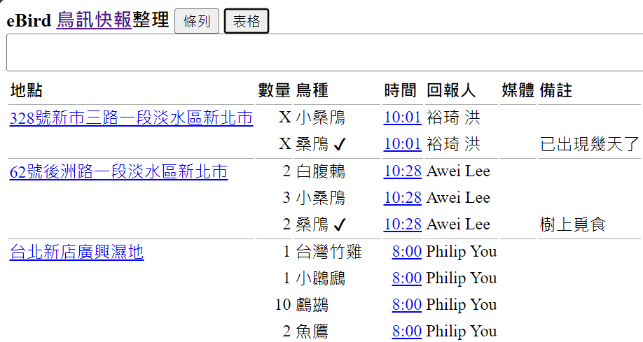

# InfoProcess

## [eBird 鳥訊快報整理](https://christorng.github.io/InfoProcess/eBird/)

因為訂閱 [eBird 鳥訊快報](https://ebird.org/alerts)，覺得純文字內容閱讀很吃力，故自己寫了 [eBird 鳥訊快報整理](https://christorng.github.io/InfoProcess/eBird/)網頁。它會將相同地點之項目群組起來，可輕易看到某地所有的鳥種項目。也把超連結加在地點及時間上，瀏覽時不會看到網址。另將地點及鳥名中外文部份皆刪除，僅留中文部份，看起來應該輕鬆多了。畫面很陽春，只是為了符合自己的需求，文字解析一定還有很多漏洞。希望對大家有一點幫助。

## [Clipboard to HTML](https://christorng.github.io/InfoProcess/Clipboard/)

While using Outlook or other apps, they lack of good translation function.
So you can copy anything, paste into this little tool to show them on the web page,
then you can use browser's built-in translation function.